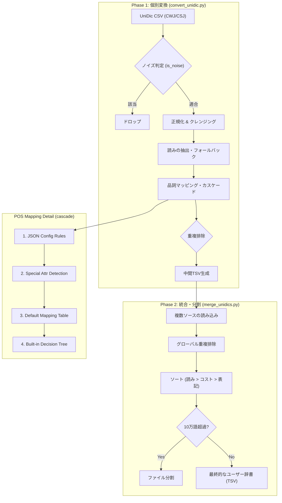

# UniDic to Mozc: プロジェクト詳細説明書 (Technical Specifications)

本ドキュメントでは、「UniDic to Mozc Integration」プロジェクトにおける「法務・運用・品質」課題解決へのアプローチ、詳細な設計思想、統計結果、および技術的な検証結果について解説します。

> [!NOTE]
> 辞書のインポート方法や、変換スクリプトの詳しい使い方・カスタマイズといった**取扱説明書（マニュアル）**については、👉 [**README.md**](README.md) をご参照ください。

## プロジェクトの前提と想定する対象ユーザー

本プロジェクトは、「導入の手軽さ」と「クリーンで実用的な語彙」を求める、以下のようなユーザーを対象に設計されています。

本プロジェクトの目的は、「Mozcの語彙数増加」ではなく「入力体験の向上」にあります。現代の日本語入力における最適な体験を再定義するため、以下の3つの大前提に基づいて構築されており、これらの価値観に共鳴するユーザーを対象としています。

### 1. 技術的障壁の破壊（入力環境改善の民主化）

【思想】かつての強力な拡張辞書システムは、複雑なC++のビルドツールチェーンを扱える、ごく一部のパワーユーザーだけの特権でした。しかし、本プロジェクトは「文字を入力するすべての人が、等しく快適なタイピング環境を享受できるようにする」という思想からスタートしています。

【対象】そのため、CLIや開発環境に触れることなく、GUIの辞書ツールからTSVファイルを読み込むだけで完結するという「極限まで敷居の低い導入」を大前提としています。

### 2. 日常の「認知摩擦」を減らす（汎用性への回帰）

【思想】IMEの辞書拡張は、「普段のメールや資料作成で生じる、些細な変換の引っかかり（認知摩擦）の削減」にあります。

【対象】本辞書は、特定の専門領域に特化したり、またはそれらを網羅するのではなく、一般的な事務作業やビジネスコミュニケーションを行うすべてのユーザーを想定しています。奇をてらわず、学術コーパス（UniDic）に基づく「実社会のリアルな汎用語彙」によって、テキスト入力の基礎体力を底上げします。

### 3. 「引き算」によるノイズレスな思考空間の提供

【思想】変換辞書においてユーザーの思考を妨げないためには、「出したい言葉が出る」ことと同等以上に、「出したくない言葉（ノイズ）が出現しない」ことが重要です。

【対象】そのため、無差別にネットスラングや一時的なバズワードを収集するアプローチをあえて棄却しました。「真面目な文章を打っている最中に、無関係な流行語がサジェストされて気が散る」といった事態を嫌う、堅実でプロフェッショナルな入力環境を求める方を対象としています。

### 具体的なユースケース

1. 企業が従業員に支給貸与するPCにユーザー辞書導入済みのものを使用する。
1. 個人ユーザーが手軽に語彙拡張を試してみる。
1. この分野に関心のあるパワーユーザーが、改変した辞書やスクリプトを何らかのパッケージに含有させる。

## プロジェクト目的・手段 階層図

したがって、本プロジェクトにおける「目的（Why）」から「具体的な解決手段（How）」への階層構造は以下のような構造となります。ネストが深くなる（インデントが下がる）ほど、抽象的な大目的から具体的な実装手段へとブレイクダウンされています。

- **【大目的】** Mozc 使用時の入力変換効率の向上
  - **【目標】** Mozc 語彙の拡張
    - **【手段】** 外部辞書の変換・取り込み
      - **【方針】** 先行事例に見られた問題の解消と回避
        - **【方針 1】** 拡張辞書（UT辞書等）における品質問題の解消と回避
          - **【小目的】** サジェスト汚染（ノイズ肥大化）の回避
            - 収録語彙の選抜
            - 活用語の「基本形（終止形）」への強制集約
            - 変換不要語彙（表記と読みが同一の自己完結語など）の削除
            - 規範的辞書ではなく、実際の使用状況を反映した「記述的データ（UniDic）」を信頼する
          - **【小目的】** 品詞の精緻なマッピング（翻訳）
            - UniDic の詳細な形態論情報（品詞階層・活用型）をクロスチェックし、Mozc 品詞へ正確にマッピングする
        - **【方針 2】** 法務的リスクの回避
          - **【小目的】** ライセンス問題の解決あるいは回避
            - 元データの単一化とクリーン化
            - 抽出元データを国立国語研究所「UniDic」に完全一本化する
            - 修正BSD等のオープンなライセンスに準拠し、権利関係をクリアにした上でフリー化する
        - **【方針 3】** 導入・運用保守コストの極小化
          - **【小目的】** 利用障壁の回避（導入の民主化）
            - Mozcシステム辞書統合（ビルド）アプローチの問題解消
            - C++等の複雑なビルド環境整備の不要化
            - OSやツールチェーンへの依存関係の単純化
            - Mozc 本体アップデート時における再ビルド作業の不要化

### 【最終解決策（アウトプット）】

以上の運用課題を全て解決するため、「10万語ごとに分割されたユーザー辞書（TSV）」そのものをOSSとして公開する。さらに、公開ユーザー辞書のソース明示（透明性）とハッカビリティ（改変の容易さ）を担保するため、「変換プロセスを担うスクリプト（Python）」も合わせてOSS公開するという方針にしました。

---

## 1\. ビルド不要による導入の容易化

従来のシステム辞書拡張アプローチでは、Mozc本体のソースコードをBazel等のツールを用いてコンパイルする必要があり、導入に対する技術的ハードルが高いという課題がありました。

本プロジェクトでは、Mozcのユーザー辞書機能（1ファイルあたり最大10万語制限）を活用し、10万語ごとに自動分割された TSV ファイルを生成します。これにより、OS（Linux, Windows, macOS, ChromeOS等）を問わず、GUIからのインポートのみで辞書の拡張が可能となり、環境構築のコストを大幅に削減しています。

## 2\. データ処理パイプラインとノイズの抑制（Data Processing Flow）

解析用の大規模辞書をIMEへ単純にマージした場合、無数の活用形や表記揺れがそのまま変換候補として提示され、日常的なタイピングの大きな妨げ（サジェスト汚染）となります。

本システムでは、入力された約180万語の膨大なCSVストリームに対して、以下の厳格なパイプライン処理をリアルタイムで適用しています。

**【データ処理フロー】**

本プロジェクトでは、入力された約180万語の膨大なCSVストリームに対して、以下の厳格なパイプライン処理をリアルタイムで適用しています。

### 2.1. 処理フロー図 (Data Pipeline Visualization)

### 2.2. 各スクリプトの役割と動作仕様

#### 1. `convert_unidic.py` (中核変換ロジック)

このスクリプトは、膨大なUniDicソースファイルをIMEで扱える「きれいなデータ」に精製する役割を担います。

1. **ストリーム読み込み**: `csv.reader` を用いたジェネレータ処理により、メモリ枯渇を防ぎつつ一行ずつ高速に処理します。
2. **ノイズ判定と足切り (Early Return)**:
   - 動詞や形容詞の活用形を検査し、「基本形（終止形）」以外を全てドロップ。実際の活用処理はIME側のネイティブエンジンに任せることで劇的な軽量化を実現。
   - 語種コードを参照し、「不可触（処理制約のある語）」などをドロップ。
3. **正規化 (Normalization)**: 表記（Surface）や語彙素（Lemma）に含まれる全角英数字・記号を、事前コンパイルされた変換表を用いて高速に半角へ統一。
4. **読みのクレンジング (Phonetic Cleansing)**:
   - IME入力に最も適した「仮名形出現形（実際の発音に即した綴り）」を最優先で取得し、欠損がある場合は「語彙素読み」等へ段階的にフォールバック。
   - 抽出したカタカナを平仮名へ変換し、IME入力不可能な無効文字を正規表現で削除。
5. **重複排除とコストの継承**:
   - `(読み, 表記, 品詞)` のタプルをハッシュセットで管理して完全な重複を排除。
   - UniDic 固有のデータである「**単語生起コスト**（出現しやすさの対数尤度に基づくスコア）」を保持。この数値は小さいほど「一般的な言葉（頻出語）」であることを示します。
   - 中間生成ファイルでは、この数値を第5カラム（Mozcの非公式拡張フィールド）として出力します。

#### 3. 単語生起コストと変換優先順位の制御 (Cost-based Ranking)

本プロジェクトが UniDic の数値をどのように活用し、IME の変換精度を向上させているかの詳細は以下の通りです。

- **UniDic 単語生起コストの性質**:
  UniDic の `cost` カラムには、大規模コーパスに基づく統計的な出現しやすさが格納されています。
  - 低コスト（例：5000〜）：頻繁に現れる語彙（例：「日本」「行う」）。
  - 高コスト（例：15000〜）：稀に出現する専門用語や固有名詞。
- **変換候補の「並び順」への反映と最終出力の正規化**:
  本システムの `merge_unidics.py` は、内部処理においてこのコスト数値を**インテリジェント・ソート**のキーとして使用しますが、最終的な出力時には Mozc ユーザー辞書の標準仕様に準拠させるための精製を行います。
  1. **内部的な重み付け**: 読み（五十音順）でグルーピングされた単語群の中で、UniDic の生起コストが低い順に並べ替え、変換候補の上位に来るよう物理的に配置。
  2. **非公式カラムのストリップ (正規化)**: Mozc ユーザー辞書は `読み / 表記 / 品詞 / コメント` の4列構成であるため、**最終的な TSV 出力時には、内部計算用に使用した第5カラム（コスト）を完全に破棄**します。
  3. **互換性の担保**: この「内部で利用して最後は消す」というアプローチにより、配布される辞書ファイルは標準的な Mozc（Google 日本語入力を含む）の仕様と100%の互換性を持ち、インポート時のエラーを防止しています。

> [!NOTE]
> 表示順序への影響に関する技術的補足
>
> Mozc のユーザー辞書ツールはインポート後の「コスト」をユーザーが直接制御するインターフェースを持ちません。しかし、学習データが存在しない初期状態において、複数の候補が競合した際のタイブレーカーとして「ファイル内の記述順（＝インポータが処理した順）」が利用される可能性を考慮し、本プロジェクトではあえてコスト順のソートを施しています。これは、導入直後の入力体験を少しでも向上させるための、データ構造に基づくベストエフォートな最適化です。

- **複数ソース統合時の競合解決**:
  CWJ（書き言葉）と CSJ（話し言葉）の両方に存在する単語の場合、ソース間でコスト値を比較し、**より小さい（より頻出と思われる）コストを採用**して統合します。これにより、書き言葉・話し言葉の両方の統計的利点を兼ね備えた「最強の平均値」を持つ辞書データが生成されます。

#### 2. `merge_unidics.py` (統合・パッキング)

複数のソース（書き言葉のCWJ、話し言葉のCSJなど）から変換されたデータを一つにまとめ、配布可能な形態に整えます。

1. **グローバル重複排除**: 同一の単語が複数のソース（例：CWJとCSJの両方）に存在する場合、最もコスト（単語生起確率）が低く、出現しやすいほうのデータを優先して1つにまとめます。
2. **インテリジェント・ソート**: 単純な五十音順だけでなく、同じ読みの中では「出現頻度の高い順（生起コスト順）」、次いで「表記順」にソートし、変換候補の精度を最大化します。
3. **10万語の「壁」の解決**: Mozcのユーザー辞書には「1ファイルあたり10万語」というインポート制限があります。これを回避するため、全データを自動的に10万語単位で分割し、連番付きのTSVファイル群として出力します。

## 3\. NLPコーパスからIMEへの最適な品詞マッピングアルゴリズム

自然言語処理（NLP）用の学術データであるUniDicは、文章の解析を目的とした6階層にも及ぶ精緻な品詞体系（`p1`〜`p4`等）を持っていますが、これをそのままIMEのシステムで利用することは不可能です。

本システムの `map_pos_mozc` 関数は、NLPの階層的品詞情報を、Mozc が扱う45種類の品詞分類へ変換するカスケード型の判別アルゴリズムを実装しています。

**【品詞マッピングの評価順序】**

1. **外部ルールベース判定 (JSON Config)**:
   - ユーザーが作成可能な `pos_mapping.json` を最優先で評価します。
   - UniDicの `p1`〜`p4`, `cType` などのカラムに対して、「完全一致 (match)」「部分一致 (contains)」「リスト内のいずれか一致 (IN句相当)」などの条件を組み合わせたルールの配列を上から順に評価し、最初に条件を満たした出力品詞を採用します。
   - 分岐ロジックをコードから分離したことで、Pythonを書けないユーザーでもルールのパッチ当てや特殊なハックが可能になっています。
2. **ハードコード例外判定**: 「アルファベットのみで構成された語彙」などを迅速に検知し、特殊タグへマッピングして早期リターンします。
3. **単純対応表 (Default Mapping)**: NLPとIMEで完全に役割が一致する品詞（副詞、連体詞など）は、O(1) のハッシュマップ参照で素早くフォールバックマッピングします。
4. **組込ディープマッピング (Built-in Logic)**:
   - 上記をすべてすり抜けた語彙（JSON設定が存在しない場合を含む）に対して適用される、巨大な組込の決定木です。
   - 例えば `p1=動詞` の場合、さらに `cType`（活用型）を文字列解析し、「〇行五段」「サ変」「一段」などの15種類の動詞タグへ精細に分配します。「カ行五段」「サ変接続」「名詞形動」「名詞人名」などの高度な接続情報を喪失させずに変換することで、解析用データをIME用の入力補助データとして完全に機能させています。

## 4\. ライセンスの明確化とデータの検証可能性

多様なWeb辞書やデータを統合する従来のアプローチでは、ライセンスの非互換性による問題が生じやすく、配布・開発が停止する事例も見られました。

本プロジェクトでは、抽出ソースを「GPL v2.0 / LGPL v2.1 / 修正BSD」のトリプルライセンスで提供されている「UniDic」のみに限定し、権利関係の明確化を図っています。また、出力される辞書データは暗号化されたバイナリ形式ではなくテキスト形式（TSV）であるため、ユーザー自身が内容を検証、編集、再加工することが容易な構造となっています。

本プロジェクトにおいては、生成したユーザー辞書と変換スクリプトの両方を公開しています。

公開の主眼はユーザー辞書であり、スクリプトは検証可能性とハッカビリティのためにオープンソースとしています。

## 5\. CWJおよびCSJの統合による語彙の拡充

本システムは、「現代書き言葉均衡コーパス（CWJ）」に由来する専門用語や固有名詞と、「日本語話し言葉コーパス（CSJ）」に由来する口語表現を、重複を排除しつつ統合しています。

これにより、技術文書や論文などで求められる専門性の高い記述から、SNSやチャットなどのカジュアルなコミュニケーションまで、単一のIME環境で幅広い文脈に対応できる変換精度を提供します。

## 6\. 既存環境および競合システムとの比較

本アプローチが既存の日本語入力環境において独自の価値を持つ背景を明確にするため、代表的なIME環境および先行プロジェクトとの比較検証を行います。

### 6.1. OS標準入力メソッド（MS-IME, macOS標準日本語入力 等）

- **特徴**: OSに標準搭載されており、PC初心者を含む全ユーザーを対象に「無難で保守的」な辞書調整が行われています。
- **課題**: 一般大衆向けであるため、そもそもの収録語彙数が少ないのに加え専門分野の用語（IT、医学、地理など）や最新の口語表現のカバー率が低く、プロフェッショナルな執筆やコーディングの際には変換の「もたつき」や手動登録の手間が発生します。
- **本プロジェクトのアプローチ**: UniDicに裏打ちされた約36万の語彙素により、学術用語からリアルな口語表現までを網羅。OS標準辞書の「痒い所に手が届かない」語彙不足を、ローカル環境のままに解消します。

### 6.2. Google 日本語入力（プロプライエタリ版）

- **特徴**: Web上の膨大なテキストデータをクロールして構築された、強力なクラウドサジェスト機能が特徴です。流行語やネットスラングの反映速度に優れています。
- **課題**: 収集データが極めて広範であるため、極端な表記揺れや不適切な単語が上位に表示される「サジェスト汚染」が発生しやすくなります。また、入力内容に基づく学習・予測機能は、機密情報を取り扱う実務においてプライバシー上の懸念を伴います。
- **本プロジェクトのアプローチ**: 入力ソースを純粋な学術コーパスのみに限定し、さらに「基本形」に絞り込むことで、サジェストノイズを極限まで排除しました。また、完全ローカル（オフライン）で動作する静的辞書であるため、情報漏洩のリスクは皆無です。

### 6.3. プレミアムIME（ATOK 等）

- **特徴**: 有償（サブスクリプション等）で提供され、AIを活用した高度な文脈解析、同音異義語の解説、強力な校正支援機能を備えています。出版社編纂の国語辞典データセットを使った「正しい日本語（規範的）」を記述するための手厚いサポートが強みです。また、それらを組み合わせることができるカスタマイズ性もあります。
- **課題**: 口語的な辞書や、若者言葉などの辞書が用意されている場合もありますが、規範的なアプローチを重視するため、ユーザーの生の思考に近い俗語や、生々しい記述的データへの対応は遅れる傾向にあります。また、システムがブラックボックス化されており、ユーザー自身による動作原理の検証やハック（改造）は困難で、利用規約でも再抽出や改変は制限されています。またクラウド変換などの機能についてはGoogle 日本語入力同様プライバシー上の懸念を伴います。
- **本プロジェクトのアプローチ**: 「校正」ではなく「記述的な入力の高速化」に特化しています。オープンソースのMozcエンジンと無償の学術コーパスを組み合わせることで、コストゼロでありながら、内容を全てテキスト（TSV）として検証・改変できるハッカブルな入力環境を提供します。

### 6.4. 先行するオープンソース拡張辞書（mozc-ut, NEologdマージ 等）

- **特徴**: WikipediaやWeb辞書など、多様なソースを無差別にマージして語彙数の最大化（数百万語規模）を志向した、パワーユーザー向けプロジェクト群です。
- **課題**: 活用形を含めた膨大なデータをシステム辞書に取り込むため、深刻なサジェスト汚染につながる懸念がつきまといます。さらに、システム辞書を直接上書きするための「複雑なC++ビルドチェインへの依存」は参入利用の障壁が高く、そして多様なデータソースの混在による「ライセンスの非互換性（コンタミネーション）」の指摘があり、主要プロジェクトが開発・公開の停止となった経緯があります。この指摘の妥当性や解釈についてはここでは言及しませんが、OSSの持続性を考慮するうえで十分に検討が必要な部分であることは確かでしょう。
- **本プロジェクトのアプローチ**: 出典をトリプルライセンスで保護されたUniDicに限定することで法的リスク（ライセンス汚染）を完全に排除しました。また、10万語分割のTSVインポート方式を採用したことでビルド依存から脱却し、基本形集約アルゴリズムによって軽量化とノイズ除去を同時に達成しています。

### 6.5. 比較総括表

| 比較対象                 | 本プロジェクトの立ち位置・差異                       | 克服した主な課題                         |
| :----------------------- | :--------------------------------------------------- | :--------------------------------------- |
| **OS標準IME**            | プロ・専門用途に耐えうる圧倒的な語彙素の供給         | 専門用語・口語表現の不足                 |
| **Google 日本語入力**    | ノイズのないクリーンな変換と、完全なプライバシー保護 | サジェスト汚染、情報漏洩リスク           |
| **ATOK（有償）**         | コストゼロで、記述的（生の思考）に直結する爆速入力   | 規範的ゆえの認知摩擦、ブラックボックス   |
| **先行拡張プロジェクト** | ビルド不要の容易な導入と、法的にクリーンなオープン性 | ビルドの壁、ライセンス汚染、ノイズ肥大化 |

---

## 7\. 既存の言語資源と処理系を活用したシステム設計

本システムは独自のエンジンやデータの新規構築を行わず、既存の確立された技術とリソースを接続することに特化しています。

- **言語資源**：国立国語研究所が編纂した大規模コーパス「UniDic」。
- **処理系**：Googleが開発した文法処理エンジン「Mozc」。

本プロジェクトは、システム本体のコード改変を行わず、第一の言語資源から第二の処理系が解釈可能なフォーマット（基本形・最適化品詞・TSV）へデータを変換するインターフェースとして機能します。これにより、両者の利点を生かしつつ、保守性の高い環境を実現しています。

## 8\. UNIX哲学に照らした設計思想

本プロジェクトのアーキテクチャは、オープンソースソフトウェアの基盤となる「UNIX哲学（UNIX Philosophy）」の主要な原則を色濃く反映しており、これがシステムの堅牢性と拡張性を担保しています。

- **「一つのことを、うまくやれ (Do one thing and do it well)」**: 本システムはGUIの提供やIME本体の機能拡張といった越権行為を行わず、「巨大な学術CSVデータを入力とし、フィルタリングとマッピングを施して、IME用のTSVを出力する」という単一のテキスト処理（フィルター）に特化しています。
- **「データはテキストストリームとして扱え (Write programs to handle text streams)」**: 最終出力をバイナリ（.dic等）にコンパイルするのではなく、普遍的なインターフェースであるプレーンなタブ区切りテキスト（TSV）として出力します。これにより、ユーザーは grep や awk といった標準的なUNIXコマンドを用いて辞書データを自由に検索・加工・再利用できる究極のポータビリティを獲得しています。
- **「シンプルさはすべてに勝る (Worse is better)」**: システム辞書を直接ハックしてビルドする従来のアプローチは、パフォーマンス面では理論上「完璧」かもしれませんが、複雑なビルドツールチェーンへの依存という脆さを抱えていました。本プロジェクトは「ユーザー辞書の10万語制限を、ファイルを単純分割することで回避する」という泥臭くも極めてシンプルな解決策を採用しました。このシンプリシティこそが、OSのアップデート等に左右されず永続的に動き続けるための絶対条件です。
- **「グルーコードとしての軽量言語の活用 (Glue code)」**: 巨大で複雑なC++プログラム（Mozc本体）を直接改変するのではなく、Pythonという軽量スクリプト言語を用いて、「UniDic」と「Mozc」という二つの独立した巨大システムを繋ぐ「薄く強靭な糊（Glue）」として機能させています。これにより、システムの保守性とハッカビリティ（改変の容易さ）を劇的に向上させました。

## 9\. 「便宜的マッピング」によるアーキテクチャの応用と将来展望

本システムは現代日本語の入力精度最大化を目的としていますが、その基盤である「入力CSV → 品詞マッピング → 最適化TSV」のパイプラインは、他領域への応用も可能です。特に、古語や近代文語などの歴史的語彙の入力支援において、本システムのアプローチが有効に機能します。

Mozcの文法エンジンは現代語（IPA辞書体系）に特化しており、古語特有の活用をネイティブに処理することはできません。しかし、本システムの品詞マッピング機能を応用し、歴史的語彙を現代語の近似品詞へ**「便宜的にマッピング」**することで、実用的な入力環境を構築できます。

例えば、国語学的な厳密さ（システムが文語四段活用として認識するか等）よりも「ユーザーが目的の文字列を素早く出力する」という便宜性を優先し、頻出する古文の連語を「名詞」や「感動詞」として一括登録する、あるいは文語の助動詞を現代語の「助動詞,非自立」へ強制的に割り当てるなどの手法が考えられます。 本プロジェクトのアーキテクチャは、このような「歴史・方言・専門分野など、特定領域に特化した実用サブ辞書」を柔軟かつ高速に生成・検証するためのプラットフォームとして、高いスケーラビリティを有しています。

## 10\. ユーザー主導の拡張性とフェイルセーフ設計（Hackability）

本プロジェクトは、ユーザー自身が動作原理を検証し、自身の用途に合わせて自由に改造できることを重視して設計されています。

変換スクリプト（`convert_unidic.py`）では、デフォルトでサジェスト汚染を防ぐため、`is_noise` 関数内で「記号」や「補助記号」を全てノイズとして弾き（ドロップし）、処理を終了させています。
しかしその後の `map_pos_mozc_builtin`（品詞マッピング）のロジック内には、「顔文字ならMozcの顔文字へ」「句読点ならMozcの句読点へ」と細大漏らさず分類する緻密な判定ロジックが記述されています。

これは、**将来ユーザーが「やっぱりUniDicの顔文字や記号も辞書に取り込みたい」と考えた際への拡張性の担保**です。もしマッピング処理を省いていた場合、ユーザーが `is_noise` の1行をコメントアウトして足切りを解除した瞬間、全ての記号が「名詞」など誤ったデフォルト品詞に吸い込まれ、Mozcの動作を狂わせてしまいます。
しかし現在の実装であれば、ユーザーが `is_noise` の該当行を1行無効化するだけで、あらかじめ用意されていた記号用マッピングの道が即座に開通し、システムを一切壊すことなく美しく記号をインポートできるようになります。

---

## 品詞体系のマッピングロジックと統計結果

**【品詞マッピング統計（抽出元データとの比較）】** 抽出元である UniDic CWJ の初期語彙（約 102 万語）と、各種フィルタを実行した Mozc 出力語彙（約 35.4 万語）の比較です。

| Mozc 指定品詞       | 出力数（本辞書） |   構成比 | \[参考\] UniDic 元データ要素数 | 削減・最適化の要因                                   |
| :------------------ | ---------------: | -------: | -----------------------------: | :--------------------------------------------------- |
| **名詞**            |          164,912 |   46.50% |                        327,910 | サ変・人名・地名等への細分化分離による減少           |
| **人名**            |           87,253 |   24.60% |                             \- | 一般名詞・固有名詞からの精密抽出                     |
| **地名**            |           25,679 |    7.24% |                             \- | 同上                                                 |
| **名詞サ変**        |           15,428 |    4.35% |                             \- | 同上                                                 |
| **動詞全体**        |           30,613 |    8.63% |                        617,288 | **「基本形（終止形）」への強制集約による劇的な圧縮** |
| 　動詞一段          |           13,868 |    3.91% |                             \- | 活用型から一段への分配                               |
| 　動詞（〇行五段）  |           16,745 |    4.72% |                             \- | 活用型から9行別への完全分配                          |
| **固有名詞**        |           12,974 |    3.66% |                             \- | 人名・地名以外の固有名詞                             |
| **形容詞**          |            4,983 |    1.40% |                         53,561 | 基本形への集約                                       |
| **副詞**            |            4,821 |    1.36% |                         11,510 | 記号混じり等のノイズ排除                             |
| **名詞形動**        |            3,559 |    1.00% |                          4,570 | Mozc仕様の「名詞形動」へマッピング。語の活用を可能に |
| **接尾一般**        |            1,075 |    0.30% |                          2,333 | 人名・地名・助数詞への再配置                         |
| **感動詞**          |              880 |    0.25% |                          3,129 | 日常入力に不要なノイズ排除                           |
| **その他特殊/付属** |            2,490 |    0.70% |                             \- | 取捨選択してマッピング                               |
| **合計**            |      **354,667** | **100%** |               **約 1,027,505** | （話し言葉 CSJ を含むマージ後の最終件数）            |

---

## 11\. 補遺：日本語学および辞書学的視点に基づくアプローチの妥当性検証

本プロジェクトのデータ処理手法は、最新の辞書学（Lexicography）および日本語の形態論的アプローチに基づき、単なる「データ変換」を超えた言語学的な最適化を行っています。

### 1\. 語彙素（Lemma）指向の立項管理と正規化

コーパス（CWJ/CSJ）は生の言語使用の記録（記述的データ）であり、そのままでは表記揺れや活用形が混在したノイズの多い状態です。

- **課題**: 同一の単語が「読書」「読書法」「読書する」など、異なる単位で混在する。
- **解決**: 本プロジェクトでは、UniDicの「語彙素（Lemma）」カラムを主キーとして、動詞や形容詞を「基本形（終止形）」へ強制集約しています。これは、「見出し語は活用を除いた抽象的な一単位であるべき」という辞書学の基礎原則に則っており、IMEにおいてユーザーが最も自然に想起する変換候補（辞書フォーム）での立項を実現しています。

### 2\. 形態論的短単位（SUW）とIME連接モデルの橋渡し

UniDic は形態論に基づく「短単位（Short Unit Word: SUW）」を基準に構築されています。これは文章の「解析（分解）」には最適ですが、IMEという「生成（結合）」エンジンに適合させるには工夫が必要です。

- **SUW採用の理由**: Mozc（Google 日本語入力エンジンのオープンソース版）は、単語間の接続関係（連接コスト）を計算して文章を構成します。もし「長単位（長い複合語）」を大量に登録してしまうと、エンジン側の細かな文法処理がバイパスされ、不自然な文脈判断を招く恐れがあります。
- **適合プロセス**: 本プロジェクトは、UniDicの緻密な品詞情報をMozcの品詞体系へ「翻訳（マッピング）」することで、短単位ひとつひとつの「つながりやすさ」をIME側に正確に伝えます。活用形を網羅せず基本形のみを提供し、実際の活用変化はIME側の強力なエンジンに委ねることで、辞書サイズの軽量化と精度の高い文章変換を両立させています。

### 3\. IMEの性質と「記述的データ」による認知摩擦の解消

IMEの最大の目的は、「ユーザーの脳内にある思考を、物理的なテキストへ変換する際の摩擦（Cognitive friction）を最小化すること」です。

- **規範的（Prescriptive）アプローチの限界**: 伝統的な辞典や規範的なルールのみに依存すると、新語や技術用語、あるいは「実際に使われているが、辞書には載っていない口語表現」を変換できず、ユーザーの思考を中断させてしまいます。
- **記述的（Descriptive）アプローチの優位性**: UniDic（CWJ/CSJ）は、現代日本人が実際に発信した膨大なテキストに基づいています。この「実態（共時的な言語実態）」を反映したデータをIMEに組み込むことで、ユーザーの言語感覚とシステムの出力が高度に一致し、「思考がそのまま文字になる」タイピング体験を提供します。

### 4\. 「仮名形出現形」の選択による発音と表記の整合性

IMEにおいて「読み」の精度は生命線です。UniDicには「語彙素読み」や「語形読み」など複数の音情報が含まれています。

- **最適化ロジック**: 本プロジェクトでは、実際の発音実態に近い「仮名形出現形」を最優先で取得しています。これにより、歴史的かなづかいや特殊な読み（例：「ヴァ」と「バ」の揺れなど）に対して、コーパス上の出現実態に基づいた「最も入力される可能性の高い読み」を自動的に割り当てています。

### 5\. 統計的正当性：大規模コーパスに基づく生起コストの活用

本プロジェクトは、UniDicが提供する「単語生起コスト（出現確率の指標）」を捨てていません。

- **アルゴリズムへの反映**: 前述の通り、第5カラム（コスト）を利用したソートにより、同じ「読み」を持つ候補の中でも、大規模な統計データに基づいて「より一般的で使われやすい単語」が上位に表示されるよう、TSV構造そのものを最適化しています。これは、経験則や主観に頼らない、大規模データ駆動（Data-driven）な辞書構築アプローチの結果です。

---

## 使用データセット (Base Datasets)

本プロジェクトのシステム構築および実証においては、以下のデータセットをベースとして使用しています。

- **現代書き言葉UniDic (UniDic-CWJ)**
  - ファイル名: `unidic-cwj-202512_full.zip`
  - リリース日: 2025-12-31
- **現代話し言葉UniDic (UniDic-CSJ)**
  - ファイル名: `unidic-csj-202512_full.zip`
  - リリース日: 2025-12-31

## 謝辞および参考文献 (Acknowledgments and References)

本プロジェクトは、国立国語研究所（NINJAL）が構築・公開している言語資源（コーパスおよび形態素解析用電子化辞書）を基盤として開発されました。多大な時間と労力をかけてこれらの最高峰のデータセットを編纂し、オープンなライセンスで学術および開発コミュニティに提供してくださっている研究者の皆様に、深く感謝申し上げます。

**現代書き言葉UniDic (UniDic-CWJ) 関連**

- 岡 照晃: 「CRF素性テンプレートの見直しによるモデルサイズを軽量化した解析用UniDic ― unidic-cwj-2.2.0 と unidic-csj-2.2.0 ―」, 『言語資源活用ワークショップ2017発表予稿集』, pp.143-152 (2017).
- Yasuharu Den, et al. "The development of an electronic dictionary for morphological analysis and its application to Japanese corpus linguistics", Japanese Linguistics, Vol.22, pp.101-123 (2007).

**現代話し言葉UniDic (UniDic-CSJ) 関連**

- 伝 康晴, ら: 「コーパス日本語学のための言語資源：形態素解析用電子化辞書の開発とその応用」, 『日本語科学』, Vol.22, pp.101-123 (2007).
- 伝 康晴. 「多様な目的に適した形態素解析システム用電子化辞書」, 『人工知能学会誌』, Vol.24, No.5, pp.640-646 (2009).

## 先行プロジェクトおよび関連ツール (Prior Projects and Related Tools)

本プロジェクトの課題設定およびシステム設計にあたり、以下の先行プロジェクトにおけるオープンソースコミュニティの試行錯誤と知見を大いに参考にさせていただきました。多大な貢献を残された開発者の皆様に敬意を表します。

- **UT Dictionary (mozc-ut) プロジェクト**: 長年にわたりMozcの語彙拡充においてコミュニティを牽引した偉大な先行プロジェクトです。同プロジェクトが直面したビルドチェインの複雑化やライセンスの非互換性といった課題は、本プロジェクトが「ユーザー辞書分割インポート方式」や「単一出典（クリーンライセンス）の徹底」という設計思想に至るための重要なユースケースとなりました。
- **dict-to-mozc および関連する辞書変換スクリプト群**: テキストベースの辞書データをMozcで利用可能な形式へ変換する、先人たちによる様々なアプローチです。これらのスクリプト群によるテキスト処理の実装例や運用上の課題は、本システムにおけるPythonを用いたフィルタリング・マッピング処理（グルーコード）の実装アプローチを策定する上で、貴重な技術的参照点となりました。
- **Mozcdict-EXT**:
  巨大拡張辞書「mozc-ut」の開発・公開終了を受け、ライセンスのクリーン化を目指して立ち上がった後継的な代替プロジェクトです。同プロジェクトではクロスプラットフォーム形態素解析器（Sudachi等）の辞書統合が試みられましたが、同時に「NLPコーパスの複雑な品詞体系（180種以上）を、Mozcの内部的な巨大品詞体系（約2,600種）へ紐付ける」という、途方もない技術的壁（品詞マッピングの限界）が浮き彫りになりました。ソースコード等において直接的な関係性は無いものの、プロジェクトの方向性を思慮するうえで大変参考にさせていただきました。
