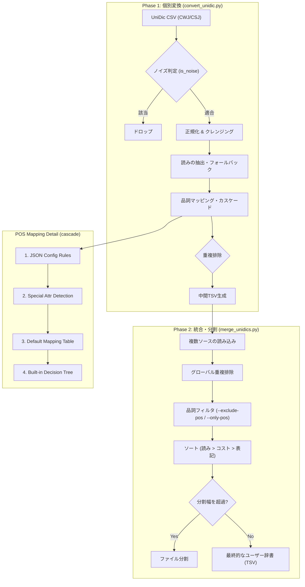

# UniDic to Mozc: プロジェクト詳細説明書 (Technical Specifications)

本ドキュメントでは、「UniDic to Mozc Integration」プロジェクトにおける「法務・運用・品質」課題解決へのアプローチ、詳細な設計思想、統計結果、および技術的な検証結果について解説します。

> [!NOTE]
> 辞書のインポート方法や、変換スクリプトの詳しい使い方・カスタマイズといった**取扱説明書（マニュアル）**については、👉 [**README.md**](README.md) をご参照ください。

## プロジェクトの前提と想定する対象ユーザー

本プロジェクトの目的は、**Mozc が持っていない語彙を補うこと**です。

当初は「入力体験の向上」を掲げていましたが、実測の結果この表現は正確ではないと分かりました。日常語の変換精度は改善しませんでした（第1候補一致 87.1% → 85.5%）。Mozc 単体で既に上位10件のカバー率が100%であり、追加辞書が入り込む余地がそもそもありません。

一方で、収録語の 51.5%（約13.8万語）は Mozc が元から出せない語です。**この辞書はトレードオフであり、語彙の空白を埋めたい人のためのものです。**

以下の3つを前提として設計しています。

### 1. 技術的障壁の破壊（入力環境改善の民主化）

【思想】かつての強力な拡張辞書システムは、複雑なC++のビルドツールチェーンを扱える、ごく一部のパワーユーザーだけの特権でした。しかし、本プロジェクトは「文字を入力するすべての人が、等しく快適なタイピング環境を享受できるようにする」という思想からスタートしています。

【対象】そのため、CLIや開発環境に触れることなく、GUIの辞書ツールからTSVファイルを読み込むだけで完結するという「極限まで敷居の低い導入」を大前提としています。

### 2. 語彙の空白を埋める

【思想】日常語は Mozc が既によく変換します。埋めるべきは、標準の辞書に載っていない語です。

【対象】学術・専門用語、文語形、地名、略語・外来語・単位記号を扱う方を想定しています。品詞別の実測では `アルファベット`（`MVP` `CFA` `Gesellschaft` `ぐらむ→g` 等）の追加率が 93.8% と最も高く、動詞や一般名詞も約半数が Mozc に無い語でした。

逆に、一般的な事務作業やビジネスコミュニケーションだけであれば**導入の利点は小さく、むしろわずかに不利**です。その用途には勧めません。

### 3. 主張を実測で裏づける

【思想】辞書の良し悪しは体感で語られがちですが、それでは検証も改善もできません。

【対象】主張の根拠を自分で確かめたい方を想定しています。`eval/` に測定スクリプトを同梱しており、本書に載せた数値はすべて再現できます。稼働中の `mozc_server` へ IPC で接続し、辞書の有無で実際に変換させて比較する仕組みも含みます。

実際にこの測定によって、当初の説明のうち「CWJ と CSJ の統合による語彙の拡充」「1ファイル最大10万語の制限」「サジェストノイズを極限まで排除」の3点が誤りであることが判明し、訂正しています。

### 想定しないもの

- **複合語**: UniDic は短単位（SUW）辞書のため、`構造体` `非同期` `廃藩置県` `万葉仮名` のような複合語は収録されていません
- **新語・ネットスラング**: UniDic の基盤は2000〜2010年代の均衡コーパスです

### 具体的なユースケース

1. 学術・専門的な文章を書く個人ユーザーが、変換できない語の頻度を下げる。
1. パワーユーザーが、改変した辞書やスクリプトを何らかのパッケージに含有させる。
1. 他コーパスや他IMEへ、本リポジトリの品詞マッピング（`config/pos_mapping.json`）を転用する。

## プロジェクト目的・手段 階層図

したがって、本プロジェクトにおける「目的（Why）」から「具体的な解決手段（How）」への階層構造は以下のような構造となります。ネストが深くなる（インデントが下がる）ほど、抽象的な大目的から具体的な実装手段へとブレイクダウンされています。

- **【大目的】** Mozc が変換できない語彙の補完
  - **【目標】** Mozc 語彙の拡張
    - **【手段】** 外部辞書の変換・取り込み
      - **【方針】** 先行事例に見られた問題の解消と回避
        - **【方針 1】** 拡張辞書（UT辞書等）における品質問題の解消と回避
          - **【小目的】** 収録語数の抑制（辞書の肥大化の回避）
            - 収録語彙の選抜
            - 活用語の「基本形（終止形）」への強制集約
            - 変換不要語彙（表記と読みが同一の自己完結語など）の削除
            - 規範的辞書ではなく、実際の使用状況を反映した「記述的データ（UniDic）」を信頼する
          - **【小目的】** 品詞の精緻なマッピング（翻訳）
            - UniDic の詳細な形態論情報（品詞階層・活用型）をクロスチェックし、Mozc 品詞へ正確にマッピングする
        - **【方針 2】** 法務的リスクの回避
          - **【小目的】** ライセンス問題の解決あるいは回避
            - 元データの単一化とクリーン化
            - 抽出元データを国立国語研究所「UniDic」に完全一本化する
            - 修正BSD等のオープンなライセンスに準拠し、権利関係をクリアにした上でフリー化する
        - **【方針 3】** 導入・運用保守コストの極小化
          - **【小目的】** 利用障壁の回避（導入の民主化）
            - Mozcシステム辞書統合（ビルド）アプローチの問題解消
            - C++等の複雑なビルド環境整備の不要化
            - OSやツールチェーンへの依存関係の単純化
            - Mozc 本体アップデート時における再ビルド作業の不要化

> [!NOTE]
> **この階層図のうち、実測で裏づけが取れたのは「語彙の拡張」と「導入コストの極小化」です。**
>
> - 語彙の拡張: 収録の 51.5%（約13.8万語）は Mozc が元から出せない語でした
> - 導入コストの極小化: 配布は1ファイルになり、インポート操作は1回で済みます
> - 品詞マッピング: JSON経路と組込経路が全 791,692 行で一致することを検証しています
>
> 一方、**「変換候補のノイズ削減」は達成できていません。** 基本形集約により語数は
> 抑えられていますが、それでも1読みあたり平均 8.2 件の候補を追加しており、
> 日常語の第1候補一致率は 87.1% から 85.5% で、改善は検出できませんでした。
> 詳細は「辞書品質の測定」を参照してください。

### 【最終解決策（アウトプット）】

以上の運用課題を全て解決するため、「そのままインポートできるユーザー辞書（TSV）」そのものをOSSとして公開する。さらに、公開ユーザー辞書のソース明示（透明性）とハッカビリティ（改変の容易さ）を担保するため、「変換プロセスを担うスクリプト（Python）」も合わせてOSS公開するという方針にしました。

---

## 1\. ビルド不要による導入の容易化

従来のシステム辞書拡張アプローチでは、Mozc本体のソースコードをBazel等のツールを用いてコンパイルする必要があり、導入に対する技術的ハードルが高いという課題がありました。

本プロジェクトでは、Mozcのユーザー辞書機能を活用し、GUIからインポートできる TSV ファイルを生成します。これにより、OS（Linux, Windows, macOS, ChromeOS等）を問わず、GUIからのインポートのみで辞書の拡張が可能となり、環境構築のコストを大幅に削減しています。

## 2\. データ処理パイプラインとノイズの抑制（Data Processing Flow）

解析用の大規模辞書をIMEへ単純にマージした場合、無数の活用形や表記揺れがそのまま変換候補として提示され、日常的なタイピングの大きな妨げ（サジェスト汚染）となります。

本システムでは、入力された約180万語の膨大なCSVストリームに対して、以下の厳格なパイプライン処理をリアルタイムで適用しています。

**【データ処理フロー】**

本プロジェクトでは、入力された約180万語の膨大なCSVストリームに対して、以下の厳格なパイプライン処理をリアルタイムで適用しています。

### 2.1. 処理フロー図 (Data Pipeline Visualization)


```mermaid
graph TD
    subgraph "Phase 1: 個別変換 (convert_unidic.py)"
        A["UniDic CSV (CWJ/CSJ)"] --> B{"ノイズ判定 (is_noise)"}
        B -- 該当 --> C[ドロップ]
        B -- 適合 --> D["正規化 & クレンジング"]
        D --> E["読みの抽出・フォールバック"]
        E --> F["品詞マッピング・カスケード"]
        F --> G{重複排除}
        G --> H[中間TSV生成]
    end

    subgraph "Phase 2: 統合・分割 (merge_unidics.py)"
        H --> I[複数ソースの読み込み]
        I --> J[グローバル重複排除]
        J --> JF["品詞フィルタ (--exclude-pos / --only-pos)"]
        JF --> K["ソート (読み > コスト > 表記)"]
        K --> L{"分割幅を超過?"}
        L -- Yes --> M[ファイル分割]
        L -- No --> N["最終的なユーザー辞書 (TSV)"]
    end

    subgraph "POS Mapping Detail (cascade)"
        F --> F1[1. JSON Config Rules]
        F1 --> F2[2. Special Attr Detection]
        F2 --> F3[3. Default Mapping Table]
        F3 --> F4[4. Built-in Decision Tree]
    end
```

### 2.2. 各スクリプトの役割と動作仕様

#### 1. `convert_unidic.py` (中核変換ロジック)

このスクリプトは、膨大なUniDicソースファイルをIMEで扱える「きれいなデータ」に精製する役割を担います。

1. **ストリーム読み込み**: `csv.reader` を用いたジェネレータ処理により、メモリ枯渇を防ぎつつ一行ずつ高速に処理します。
2. **ノイズ判定と足切り (Early Return)**:
   - 動詞や形容詞の活用形を検査し、「基本形（終止形）」以外を全てドロップ。実際の活用処理はIME側のネイティブエンジンに任せることで劇的な軽量化を実現。
   - 語種コード（和/漢/外/混/固/記号/不明）を `pos_mapping.json` の `noise_goshu` で参照可能。既定は空（無効）。
     UniDic の語種「記号」には `VR` `PK` `GLP` のような英字略語が3,000語以上含まれるため、これを落とすと
     IMEに有用な語彙まで失われる。
   - 品詞（p1）による記号類の除外は `noise_pos` で設定可能。既定は `["補助記号", "記号"]`。
     空にすると `(株)` `(社)` `(財)` やギリシャ文字（`α` `ε` 等）が拾える一方、
     `っ->ッ` `あるふぁ->㌁` のような実用性の低い語も入る（UniDic CWJ で計249語）。
     なお `句読点` と `顔文字` は UniDic 側に読みが無く（`kana` も `lForm` も `*`）、
     `noise_pos` を空にしても出力されない。UniDic を入力とする限り、この2品詞は原理的に生成されない。
3. **正規化 (Normalization)**: 表記（Surface）や語彙素（Lemma）に含まれる全角英数字・記号を、事前コンパイルされた変換表を用いて高速に半角へ統一。
4. **読みのクレンジング (Phonetic Cleansing)**:
   - IME入力に最も適した「仮名形出現形（実際の発音に即した綴り）」を最優先で取得し、欠損がある場合は「語彙素読み」等へ段階的にフォールバック。
   - 抽出したカタカナを平仮名へ変換し、IME入力不可能な無効文字を正規表現で削除。
5. **重複排除とコストの継承**:
   - `(読み, 表記, 品詞)` のタプルをハッシュセットで管理して完全な重複を排除。
   - UniDic 固有のデータである「**単語生起コスト**（出現しやすさの対数尤度に基づくスコア）」を保持。この数値は小さいほど「一般的な言葉（頻出語）」であることを示します。
   - 中間生成ファイルでは、この数値を第5カラム（Mozcの非公式拡張フィールド）として出力します。

#### 3. 単語生起コストと変換優先順位の制御 (Cost-based Ranking)

本プロジェクトが UniDic の数値をどのように活用しているかの詳細は以下の通りです。なお、この並べ替えが Mozc の変換候補順に実際に影響するかは未検証です（2.2 の技術的補足を参照）。

- **UniDic 単語生起コストの性質**:
  UniDic の `cost` カラムには、大規模コーパスに基づく統計的な出現しやすさが格納されています。
  - 低コスト（例：5000〜）：頻繁に現れる語彙（例：「日本」「行う」）。
  - 高コスト（例：15000〜）：稀に出現する専門用語や固有名詞。
- **変換候補の「並び順」への反映と最終出力の正規化**:
  本システムの `merge_unidics.py` は、内部処理においてこのコスト数値を**インテリジェント・ソート**のキーとして使用しますが、最終的な出力時には Mozc ユーザー辞書の標準仕様に準拠させるための精製を行います。
  1. **内部的な重み付け**: 読み（五十音順）でグルーピングされた単語群の中で、UniDic の生起コストが低い順に並べ替え、変換候補の上位に来るよう物理的に配置。
  2. **非公式カラムのストリップ (正規化)**: Mozc ユーザー辞書は `読み / 表記 / 品詞 / コメント` の4列構成であるため、**最終的な TSV 出力時には、内部計算用に使用した第5カラム（コスト）を完全に破棄**します。
  3. **互換性の担保**: この「内部で利用して最後は消す」というアプローチにより、配布される辞書ファイルは標準的な Mozc（Google 日本語入力を含む）の仕様と100%の互換性を持ち、インポート時のエラーを防止しています。

> [!NOTE]
> 表示順序への影響に関する技術的補足
>
> Mozc のユーザー辞書ツールはインポート後の「コスト」をユーザーが直接制御するインターフェースを持ちません。しかし、学習データが存在しない初期状態において、複数の候補が競合した際のタイブレーカーとして「ファイル内の記述順（＝インポータが処理した順）」が利用される可能性を考慮し、本プロジェクトではあえてコスト順のソートを施しています。これは、導入直後の入力体験を少しでも向上させるための、データ構造に基づくベストエフォートな最適化です。

- **複数ソース統合時の競合解決**:
  CWJ（書き言葉）と CSJ（話し言葉）の両方に存在する単語の場合、ソース間でコスト値を比較し、**より小さい（より頻出と思われる）コストを採用**して統合します。これにより、いずれかの文体で頻出する語が同音候補の上位に来ます。
  なお両コーパスの語彙は完全に同一であるため（5節参照）、この処理で語彙が増えることはなく、影響するのは並び順のみです。

#### 2. `merge_unidics.py` (統合・パッキング)

複数のソース（書き言葉のCWJ、話し言葉のCSJなど）から変換されたデータを一つにまとめ、配布可能な形態に整えます。

1. **グローバル重複排除**: 同一の単語が複数のソース（例：CWJとCSJの両方）に存在する場合、最もコスト（単語生起確率）が低く、出現しやすいほうのデータを優先して1つにまとめます。
2. **品詞フィルタ**: `--exclude-pos` / `--only-pos` により、品詞単位で出力を取捨します。既定の配布辞書はこれを用いて人名を除外し、人名は別辞書として切り出しています（根拠は「辞書品質の測定」を参照）。指定した品詞が入力に存在しない場合は警告を出すため、綴り誤りが黙って無視されることはありません。
3. **インテリジェント・ソート**: 単純な五十音順だけでなく、同じ読みの中では「出現頻度の高い順（生起コスト順）」、次いで「表記順」にソートし、変換候補の精度を最大化します。
4. **ファイル分割**: 語数が上限を超える場合のみ分割し、連番付きのTSVファイルとして出力します。既定の分割幅は Mozc の上限と同じ 1,000,000 語なので、現在の配布辞書（267,413 語）は分割されません。`--limit` で変更できます。

> [!WARNING]
> **「1ファイルあたり10万語」という以前の記述は誤りでした。**
>
> Mozc のソースを確認したところ、1辞書あたりの上限は **1,000,000 語** です。
>
> ```cpp
> // src/dictionary/user_dictionary_storage.cc
> constexpr size_t kMaxDictionarySize = 100;      // 辞書の「個数」の上限
> constexpr size_t kMaxEntrySize = 1000000;       // 1辞書あたりの語数の上限
> ```
>
> インポート経路も同じ上限を使います（`user_dictionary_importer.cc` が `IsDictionaryFull()` を呼び、これは `entries_size() >= max_entry_size()` を判定する）。GUI辞書ツール側に追加の語数制限はありません。
> なお `src/gui` にも `100000` は現れますが、`kSessionTimeout = absl::Milliseconds(100000)`（100秒のタイムアウト）であって語数とは無関係です。
>
> したがって既定辞書 267,413 語は1ファイルに収まります。
> **Mozc 3.33.6089.100 へ 267,413 語を1ファイルでインポートできることを実機で確認済みです。**
> この結果を受けて既定の分割幅を 1,000,000 語（＝Mozc の上限）に変更し、配布辞書は1ファイルになりました。
> インポート操作は3回から1回に減っています。

## 3\. NLPコーパスからIMEへの最適な品詞マッピングアルゴリズム

自然言語処理（NLP）用の学術データであるUniDicは、文章の解析を目的とした6階層にも及ぶ精緻な品詞体系（`p1`〜`p4`等）を持っていますが、これをそのままIMEのシステムで利用することは不可能です。

本システムの `map_pos_mozc` 関数は、NLPの階層的品詞情報を、Mozc が扱う45種類の品詞分類へ変換するカスケード型の判別アルゴリズムを実装しています。

**【品詞マッピングの評価順序】**

1. **外部ルールベース判定 (JSON Config)**:
   - ユーザーが作成可能な `pos_mapping.json` を最優先で評価します。
   - UniDicの `p1`〜`p4`, `cType` などのカラムに対して、「完全一致 (match)」「部分一致 (contains)」「リスト内のいずれか一致 (IN句相当)」などの条件を組み合わせたルールの配列を上から順に評価し、最初に条件を満たした出力品詞を採用します。
   - 分岐ロジックをコードから分離したことで、Pythonを書けないユーザーでもルールのパッチ当てや特殊なハックが可能になっています。
2. **ハードコード例外判定**: 「アルファベットのみで構成された語彙」などを迅速に検知し、特殊タグへマッピングして早期リターンします。
3. **単純対応表 (Default Mapping)**: NLPとIMEで完全に役割が一致する品詞（副詞、連体詞など）は、O(1) のハッシュマップ参照で素早くフォールバックマッピングします。
4. **組込ディープマッピング (Built-in Logic)**:
   - 上記をすべてすり抜けた語彙（JSON設定が存在しない場合を含む）に対して適用される、巨大な組込の決定木です。
   - 例えば `p1=動詞` の場合、さらに `cType`（活用型）を文字列解析し、「〇行五段」「サ変」「一段」などの15種類の動詞タグへ精細に分配します。「カ行五段」「サ変接続」「名詞形動」「名詞人名」などの高度な接続情報を喪失させずに変換することで、解析用データをIME用の入力補助データとして完全に機能させています。

> [!IMPORTANT]
> **JSON経路と組込経路は同じ結論を出す必要があります。** 片方だけを修正すると静かに乖離するため、
> `eval/check_pos_agreement.py` で `lex.csv` 全体を突き合わせる検証を用意しています。
> 実際にこの検証によって、判定対象 791,692 行のうち 1,739 行（0.44%）の乖離が発見されました。
>
> | JSON | 組込 | 件数 | 原因 |
> | :--- | :--- | ---: | :--- |
> | 助数詞 | 名詞 | 1,139 | 組込が「助数詞」を完全一致で判定し「助数詞可能」を取りこぼしていた |
> | 助数詞 | アルファベット | 144 | 同上（`atm` = 気圧の助数詞） |
> | 名詞サ変 | アルファベット | 362 | アルファベット判定の位置の違い |
> | 名詞形動 | アルファベット | 94 | 同上 |
>
> 現在はいずれも解消済みで、両経路は全件で一致します。優先順位は
> **1. UniDic が与える具体的な品詞 → 2. アルファベット → 3. 一般フォールバック** です。
> 「アルファベット」は `mozc_pos_list.md` において頭字語（IT, HTTP）を指すため、
> サ変可能・助数詞可能・形状詞といった具体的な情報がある語はそちらを優先します。

## 4\. ライセンスの明確化とデータの検証可能性

多様なWeb辞書やデータを統合するアプローチでは、権利条件の異なるデータが混在するため、生成物の再配布条件を説明することが難しくなりやすいという課題があります。

本プロジェクトでは、抽出ソースを「GPL v2.0 / LGPL v2.1 / 修正BSD」のトリプルライセンスで提供されている「UniDic」のみに限定し、権利関係の明確化を図っています。また、出力される辞書データは暗号化されたバイナリ形式ではなくテキスト形式（TSV）であるため、ユーザー自身が内容を検証、編集、再加工することが容易な構造となっています。

> [!NOTE]
> **著作権法30条の4（情報解析）との関係**
>
> 2018年の著作権法改正で第30条の4が設けられ、情報解析の用に供する場合など、著作物の表現を享受することを目的としない利用は権利者の許諾なく行えるようになりました。コーパスから語彙を抽出する行為は、この条文が想定する典型例のひとつです。
>
> ただし留保が三点あります。①同条が許すのは**解析のための利用**であり、成果物の配布が同じ枠に収まるかは別途検討を要すること（IME辞書は解析ではなく文章生成に使われます）。②「著作権者の利益を不当に害することとなる場合は、この限りでない」という但し書きがあること。③そもそも語彙リストに著作権が及ぶか（編集著作物性）という論点が残ること。
>
> なお**本プロジェクトにとってこの条文は本質的ではありません。UniDic は最初からトリプルライセンスで提供されており、例外規定に頼る必要がないからです。** 単一の明快なライセンスへ寄せる選択は、語彙の広がりを諦める代わりに、法解釈の不確実性そのものを設計から外すという意味も持っています。
>
> （筆者は法律の専門家ではありません。具体的な判断を要する場合は専門家にご相談ください。）

本プロジェクトにおいては、生成したユーザー辞書と変換スクリプトの両方を公開しています。

公開の主眼はユーザー辞書であり、スクリプトは検証可能性とハッカビリティのためにオープンソースとしています。

## 5\. CWJおよびCSJの統合と、その実際の効果

本システムは「現代書き言葉均衡コーパス（CWJ）」と「日本語話し言葉コーパス（CSJ）」の両方を入力とし、重複を排除しつつ統合しています。

> [!IMPORTANT]
> **統合による語彙の増加はありません。** 実測したところ、UniDic CWJ と CSJ の語彙は完全に同一でした。
>
> ```
> CWJ 語彙数: 354,666    CSJ 語彙数: 354,666
> 共通      : 354,666    CWJ のみ: 0    CSJ のみ: 0
> 共通語のうちコストが相違: 354,653
> ```
>
> 両者が異なるのは**単語生起コストの値のみ**です。これは UniDic の CWJ 版と CSJ 版が共通の語彙素データベースを共有し、異なるコーパスで学習したコストモデルを持つためです。

したがって統合の効果は「語彙の拡充」ではなく、**書き言葉と話し言葉の双方の統計を踏まえたコスト値の採用**にあります。`merge_unidics.py` は両者のうち低い方（＝いずれかの文体で頻出する）コストを採るため、同音候補の並び順に双方の実態が反映されます。

ただし、この並び順が Mozc の変換候補順に実際に影響するかは未検証です（2.2 の技術的補足を参照）。効果は限定的である可能性があります。

## 6\. 既存環境および競合システムとの比較

本アプローチが既存の日本語入力環境において独自の価値を持つ背景を明確にするため、代表的なIME環境および先行プロジェクトとの比較検証を行います。

### 6.1. OS標準入力メソッド（MS-IME, macOS標準日本語入力 等）

- **特徴**: OSに標準搭載されており、PC初心者を含む全ユーザーを対象に「無難で保守的」な辞書調整が行われています。
- **課題**: 一般大衆向けであるため、そもそもの収録語彙数が少ないのに加え専門分野の用語（IT、医学、地理など）や最新の口語表現のカバー率が低く、プロフェッショナルな執筆やコーディングの際には変換の「もたつき」や手動登録の手間が発生します。
- **本プロジェクトのアプローチ**: UniDicに裏打ちされた約26.7万の語彙素（人名辞書を併用する場合は約35.5万）により、学術用語・地名・文語形を中心に語彙を補います。ただし複合語は短単位辞書の性質上収録されないため、万能ではありません（「辞書品質の測定」の「判明した弱点」を参照）。

### 6.2. Google 日本語入力（プロプライエタリ版）

- **特徴**: Web上の膨大なテキストデータをクロールして構築された、強力なクラウドサジェスト機能が特徴です。流行語やネットスラングの反映速度に優れています。
- **課題**: 収集データが極めて広範であるため、極端な表記揺れや不適切な単語が上位に表示される「サジェスト汚染」が発生しやすくなります。また、入力内容に基づく学習・予測機能は、機密情報を取り扱う実務においてプライバシー上の懸念を伴います。
- **本プロジェクトのアプローチ**: 入力ソースを学術コーパスのみに限定し、活用形を「基本形」に絞り込むことで、登録語数を抑えています。ただし**「ノイズを排除した」と言えるほどの効果は実測では確認できていません** — 日常語の変換精度に改善は見られませんでした（「辞書品質の測定」参照）。完全ローカル（オフライン）で動作する静的辞書であるため、辞書自体が通信を行うことはありません。

### 6.3. プレミアムIME（ATOK 等）

- **特徴**: 有償（サブスクリプション等）で提供され、AIを活用した高度な文脈解析、同音異義語の解説、強力な校正支援機能を備えています。出版社編纂の国語辞典データセットを使った「正しい日本語（規範的）」を記述するための手厚いサポートが強みです。また、それらを組み合わせることができるカスタマイズ性もあります。
- **課題**: 口語的な辞書や、若者言葉などの辞書が用意されている場合もありますが、規範的なアプローチを重視するため、ユーザーの生の思考に近い俗語や、生々しい記述的データへの対応は遅れる傾向にあります。また、システムがブラックボックス化されており、ユーザー自身による動作原理の検証やハック（改造）は困難で、利用規約でも再抽出や改変は制限されています。またクラウド変換などの機能についてはGoogle 日本語入力同様プライバシー上の懸念を伴います。
- **本プロジェクトのアプローチ**: 「校正」ではなく「記述的な入力の高速化」に特化しています。オープンソースのMozcエンジンと無償の学術コーパスを組み合わせることで、コストゼロでありながら、内容を全てテキスト（TSV）として検証・改変できるハッカブルな入力環境を提供します。

### 6.4. 先行するオープンソース拡張辞書（mozc-ut, NEologdマージ 等）

- **特徴**: WikipediaやWeb辞書など、多様なソースを無差別にマージして語彙数の最大化（数百万語規模）を志向した、パワーユーザー向けプロジェクト群です。
- **課題**: 活用形を含めた膨大なデータをシステム辞書に取り込むため、深刻なサジェスト汚染につながる懸念がつきまといます。さらに、システム辞書を直接上書きするための「複雑なC++ビルドチェインへの依存」は参入利用の障壁が高く、そして多様なデータソースの混在により、生成物の再配布条件の説明が難しくなりやすいという構造的な課題があります。

> [!NOTE]
> **【2026-09-07 訂正】** 当初ここには「主要プロジェクトが開発・公開の停止となった経緯があります」と書いていましたが、**これは事実に反するため削除しました。**
> 確認したところ Mozc UT 辞書群は現役で活発に更新されており（2026-09 時点）、さらに既にソース別リポジトリへ分解され、README にソースごとのライセンスが明記されています。利用者が採用するソースを選択することもできます。
> 本節の論点は「先行プロジェクトが失敗した」ではなく、「多ソース統合という方式に内在するトレードオフ」として読んでください。
- **本プロジェクトのアプローチ**: 出典をトリプルライセンスで保護されたUniDicに限定することで法的リスク（ライセンス汚染）を完全に排除しました。また、TSVインポート方式を採用したことでビルド依存から脱却しました。基本形への集約により、UniDic の約102万語を約26.7万語へ抑えています（ただしノイズ削減の効果は実測では確認できていません。「辞書品質の測定」を参照）。

### 6.5. 比較総括表

| 比較対象                 | 本プロジェクトの立ち位置・差異                       | 克服した主な課題                         |
| :----------------------- | :--------------------------------------------------- | :--------------------------------------- |
| **OS標準IME**            | 学術コーパス由来の語彙を約13.8万語追加             | 専門用語・文語形・略語の不足             |
| **Google 日本語入力**    | 完全ローカルで動作し、辞書自体は通信しない         | 収集データの広さに由来するノイズ         |
| **ATOK（有償）**         | コストゼロで、内容をテキストとして検証・改変できる | 有償、ブラックボックス                   |
| **先行拡張プロジェクト** | ビルド不要の導入と、単一ソースによる法的な明快さ   | ビルドの壁、ライセンスの非互換性         |

> [!IMPORTANT]
> この表は**語彙の補完**という観点での比較です。日常語の変換精度そのものは、
> 本辞書を入れても実測では改善しませんでした（87.1% → 85.5%）。
> 「どのIMEより変換が正確になる」という主張はしていません。

---

## 7\. 既存の言語資源と処理系を活用したシステム設計

本システムは独自のエンジンやデータの新規構築を行わず、既存の確立された技術とリソースを接続することに特化しています。

- **言語資源**：国立国語研究所が編纂した大規模コーパス「UniDic」。
- **処理系**：Googleが開発した文法処理エンジン「Mozc」。

本プロジェクトは、システム本体のコード改変を行わず、第一の言語資源から第二の処理系が解釈可能なフォーマット（基本形・最適化品詞・TSV）へデータを変換するインターフェースとして機能します。これにより、両者の利点を生かしつつ、保守性の高い環境を実現しています。

## 8\. UNIX哲学に照らした設計思想

本プロジェクトのアーキテクチャは、オープンソースソフトウェアの基盤となる「UNIX哲学（UNIX Philosophy）」の主要な原則を色濃く反映しており、これがシステムの堅牢性と拡張性を担保しています。

- **「一つのことを、うまくやれ (Do one thing and do it well)」**: 本システムはGUIの提供やIME本体の機能拡張といった越権行為を行わず、「巨大な学術CSVデータを入力とし、フィルタリングとマッピングを施して、IME用のTSVを出力する」という単一のテキスト処理（フィルター）に特化しています。
- **「データはテキストストリームとして扱え (Write programs to handle text streams)」**: 最終出力をバイナリ（.dic等）にコンパイルするのではなく、普遍的なインターフェースであるプレーンなタブ区切りテキスト（TSV）として出力します。これにより、ユーザーは grep や awk といった標準的なUNIXコマンドを用いて辞書データを自由に検索・加工・再利用できる究極のポータビリティを獲得しています。
- **「シンプルさはすべてに勝る (Worse is better)」**: システム辞書を直接ハックしてビルドする従来のアプローチは、パフォーマンス面では理論上「完璧」かもしれませんが、複雑なビルドツールチェーンへの依存という脆さを抱えていました。本プロジェクトは「システム辞書を触らず、ユーザー辞書へTSVをインポートするだけ」という泥臭くも極めてシンプルな解決策を採用しました。このシンプリシティこそが、OSのアップデート等に左右されず永続的に動き続けるための絶対条件です。
- **「グルーコードとしての軽量言語の活用 (Glue code)」**: 巨大で複雑なC++プログラム（Mozc本体）を直接改変するのではなく、Pythonという軽量スクリプト言語を用いて、「UniDic」と「Mozc」という二つの独立した巨大システムを繋ぐ「薄く強靭な糊（Glue）」として機能させています。これにより、システムの保守性とハッカビリティ（改変の容易さ）を劇的に向上させました。

## 9\. 「便宜的マッピング」によるアーキテクチャの応用と将来展望

本システムは現代日本語の入力精度最大化を目的としていますが、その基盤である「入力CSV → 品詞マッピング → 最適化TSV」のパイプラインは、他領域への応用も可能です。特に、古語や近代文語などの歴史的語彙の入力支援において、本システムのアプローチが有効に機能します。

Mozcの文法エンジンは現代語（IPA辞書体系）に特化しており、古語特有の活用をネイティブに処理することはできません。しかし、本システムの品詞マッピング機能を応用し、歴史的語彙を現代語の近似品詞へ**「便宜的にマッピング」**することで、実用的な入力環境を構築できます。

例えば、国語学的な厳密さ（システムが文語四段活用として認識するか等）よりも「ユーザーが目的の文字列を素早く出力する」という便宜性を優先し、頻出する古文の連語を「名詞」や「感動詞」として一括登録する、あるいは文語の助動詞を現代語の「助動詞,非自立」へ強制的に割り当てるなどの手法が考えられます。 本プロジェクトのアーキテクチャは、このような「歴史・方言・専門分野など、特定領域に特化した実用サブ辞書」を柔軟かつ高速に生成・検証するためのプラットフォームとして、高いスケーラビリティを有しています。

## 10\. ユーザー主導の拡張性とフェイルセーフ設計（Hackability）

本プロジェクトは、ユーザー自身が動作原理を検証し、自身の用途に合わせて自由に改造できることを重視して設計されています。

変換スクリプト（`convert_unidic.py`）では、デフォルトでサジェスト汚染を防ぐため、`is_noise` 関数内で「記号」や「補助記号」を全てノイズとして弾き（ドロップし）、処理を終了させています。
しかしその後の `map_pos_mozc_builtin`（品詞マッピング）のロジック内には、「顔文字ならMozcの顔文字へ」「句読点ならMozcの句読点へ」と細大漏らさず分類する緻密な判定ロジックが記述されています。

これは、**将来ユーザーが「やっぱりUniDicの顔文字や記号も辞書に取り込みたい」と考えた際への拡張性の担保**です。もしマッピング処理を省いていた場合、ユーザーが `is_noise` の1行をコメントアウトして足切りを解除した瞬間、全ての記号が「名詞」など誤ったデフォルト品詞に吸い込まれ、Mozcの動作を狂わせてしまいます。
しかし現在の実装であれば、ユーザーが `is_noise` の該当行を1行無効化するだけで、あらかじめ用意されていた記号用マッピングの道が即座に開通し、システムを一切壊すことなく美しく記号をインポートできるようになります。

---

## 品詞体系のマッピングロジックと統計結果

**【品詞マッピング統計（抽出元データとの比較）】** 抽出元である UniDic CWJ ver.2025.12 の初期語彙（1,027,505 語）と、各種フィルタを実行した既定配布辞書（267,413 語 / 人名を除く）の比較です。

| Mozc 指定品詞       | 出力数（本辞書） |   構成比 | \[参考\] UniDic 元データ要素数 | 削減・最適化の要因                                   |
| :------------------ | ---------------: | -------: | -----------------------------: | :--------------------------------------------------- |
| **名詞**            |          158,907 |   59.42% |                        327,910 | サ変・地名等への細分化分離による減少                 |
| **動詞全体**        |           30,614 |   11.45% |                        617,288 | **「基本形（終止形）」への強制集約による劇的な圧縮** |
| 　動詞（〇行五段）  |           18,433 |    6.89% |                             \- | 活用型から9行別への完全分配                          |
| 　動詞一段          |           11,641 |    4.35% |                             \- | 上一段・下一段および文語二段からの集約               |
| 　動詞サ変          |              358 |    0.13% |                             \- | 活用型「サ行変格」からの分配                         |
| 　動詞ザ変          |              106 |    0.04% |                             \- | 「〜ずる」型の語尾判定による分離                     |
| 　動詞カ変          |               47 |    0.02% |                             \- | 活用型「カ行変格」からの分配                         |
| 　動詞ハ行四段      |               21 |    0.01% |                             \- | 文語四段ハ行の専用品詞へ割当                         |
| 　動詞ラ変          |                8 |    0.00% |                             \- | 活用型「文語ラ行変格」からの分配                     |
| **地名**            |           25,679 |    9.60% |                             \- | 固有名詞からの精密抽出                               |
| **名詞サ変**        |           15,428 |    5.77% |                             \- | 名詞からのサ変可能語の分離                           |
| **固有名詞**        |           12,974 |    4.85% |                             \- | 人名・地名以外の固有名詞                             |
| **アルファベット**  |            6,019 |    2.25% |                             \- | 全角英字を半角化した上での判定                       |
| **形容詞**          |            4,983 |    1.86% |                         53,561 | 基本形への集約                                       |
| **副詞**            |            4,817 |    1.80% |                         11,510 | 記号混じり等のノイズ排除                             |
| **名詞形動**        |            3,559 |    1.33% |                          4,570 | Mozc仕様の「名詞形動」へマッピング。語の活用を可能に |
| **助数詞**          |            1,235 |    0.46% |                             \- | 名詞・接尾辞からの再配置                             |
| **接尾一般**        |            1,075 |    0.40% |                          2,333 | 人名・地名・助数詞への再配置                         |
| **感動詞**          |              873 |    0.33% |                          3,129 | 日常入力に不要なノイズ排除                           |
| **その他特殊/付属** |            1,250 |    0.47% |                             \- | 数・接頭語・独立語・連体詞・接続詞                   |
| **合計**            |      **267,413** | **100%** |            **1,027,505** | （人名を除く。CWJ/CSJ の語彙は同一のため統合はコスト値にのみ影響）|

> [!NOTE]
> **人名 87,253 語は既定配布に含めません。** 別辞書（`mozc_unidic_names_*.tsv`）として任意提供します。
> 判断の根拠は次節の実測結果を参照してください。

---

## 辞書品質の測定（実測）

品質に関する主張を検証可能にするため、`eval/` に測定スクリプトを用意しています。外部依存はありません。

### 測っているもの・いないもの

**測っているもの**: 利用者が実際に打つ読みに対して、この辞書が何件の候補を注入し、そのうち求める表記が含まれるか。

**測っていないもの**: `measure_injection.py` 単体では Mozc の最終的な候補順位を測っていません。ここで言う「純ノイズ」は「誤変換を起こした」ではなく「求められない候補だけを増やした」の意味です。

最終的な変換結果そのものは、稼働中の `mozc_server` へ IPC で接続して実測しています（後述「実変換精度」）。

### 結果（テスト読み 124 件 / 8 カテゴリ）

| 指標 | 人名を含む場合 | **既定（人名なし）** |
| :--- | ---: | ---: |
| 語数 | 354,666 | **267,413** |
| 1読みあたり平均競合数 | 11.0 | **8.2** |
| 同音異義語カテゴリの平均競合数 | 31.1 | **24.9** |
| 注入1件あたりの有用率 | 8.5% | **11.4%** |
| 期待表記をカバーできた読み | 116 / 124 | **116 / 124** |
| 純ノイズ（期待表記を含まない注入） | 0 件 | **0 件** |
| 分割ファイル数 | 4 | **1** |

### 実変換精度（mozc_server による A/B）

`eval/measure_conversion.py` は稼働中の `mozc_server` に実際に変換させ、ユーザー辞書の有無で第1候補を比較します。辞書の ON/OFF は `user_dictionary.db` を空の辞書へ差し替えて `RELOAD_AND_WAIT` を送ることで行います。

**結果（テスト読み 124 件 / Mozc 3.33.6089.100 / 既定辞書 267,413 語）:**

| 指標 | 辞書なし | 辞書あり | 差 |
| :--- | ---: | ---: | ---: |
| 第1候補一致 | 108 (87.1%) | 106 (85.5%) | **−2** |
| 上位10件に含む | 124 (100%) | 122 (98.4%) | **−2** |

改善 1 件（`せっしょう` → 殺生 から 摂政）、悪化 3 件（`しょうえん` → 荘園 から 勝縁 など）。

> [!IMPORTANT]
> **日常語では、この辞書は変換精度を改善しません。**
> 辞書なしの時点で上位10件のカバー率が 100% であり、追加辞書が入り込む余地が
> そもそもありません。できるのは既存の順位を乱すことだけです。
>
> なお測定値は 2 件下がっていますが、この −2 は統計的にゼロと区別できません（結果が変わったのは4件のみ、McNemar 検定で p ≈ 0.63）。言えるのは「悪化した」ではなく**「改善は検出できなかった」**です。

### 辞書が本当に足している語

では辞書に価値が無いかというと、そうではありません。`eval/measure_coverage.py` で
辞書から 2,000 件を無作為抽出し、辞書なしの Mozc が同じ変換を出せるか調べました。

| 分類 | 割合 | 意味 |
| :--- | ---: | :--- |
| 既存 | 51.0% | Mozc が元から出せる。重複登録で競合を増やすだけ |
| 追加 | 45.7% | 本当に変換を増やしている（全体で約 122,000 語） |
| 未達 | 3.2% | 登録しても上位に届いていない |

品詞別では `アルファベット` の追加率が 93.8% と最も高く（`MVP` `CFA` `Gesellschaft`
`ぐらむ→g` など Mozc がほぼ持たない語）、`名詞サ変` は 28.0% とほとんどが重複でした。

**結論として、この辞書はトレードオフです。** 約 12 万語の稀な語彙を新たに打てる
ようになる代わりに、日常語の変換をわずかに悪化させます。「変換精度が向上する」
という単純な主張は成り立ちません。

なお、重複登録の 51% は `eval/scan_system_coverage.py` で全件洗い出し、
`merge_unidics.py --exclude-list` で落とせます。

### 人名を既定配布から外した理由

測定により、人名の大半が「既に別品詞でも収録されている語」か「稀すぎて入力されない語」であることが判明しました。

```
たなか/田中 : 人名, 地名          すずき/鈴木 : 人名, 固有名詞
やまもと/山本: 人名, 地名, 名詞    こばやし/小林: 人名, 地名
なかむら/中村: 人名, 地名
```

主要な姓はいずれも地名・固有名詞として重複収録されているため、**人名 87,253 語を除外してもカバレッジは 1 件も低下せず**、競合のみが約 25% 減少します。

一方で**地名は除外できません**。「大阪」「京都」「横浜」「札幌」「秩父」は品詞「地名」でしか収録されておらず、外すと語彙そのものを失います。当初は人名・地名の双方を分離する案でしたが、測定によってこれが誤りであることが分かりました。

### 判明した弱点

辞書が候補を 1 件も出せなかった読みは 124 件中 8 件でした。

```
technical : 構造体, 非同期, 再帰的
academic  : 古文書, 万葉仮名, 廃藩置県
spoken    : 確かに, 何となく
```

いずれも複合語であり、UniDic が短単位（SUW）辞書であることの構造的な帰結です。短単位採用の利点は前述の通りですが、その代償として複合語の直接変換を持たないことを、ここに明記しておきます。

---

## 11\. 補遺：日本語学および辞書学的視点に基づくアプローチの妥当性検証

本プロジェクトのデータ処理手法は、最新の辞書学（Lexicography）および日本語の形態論的アプローチに基づき、単なる「データ変換」を超えた言語学的な最適化を行っています。

### 1\. 語彙素（Lemma）指向の立項管理と正規化

コーパス（CWJ/CSJ）は生の言語使用の記録（記述的データ）であり、そのままでは表記揺れや活用形が混在したノイズの多い状態です。

- **課題**: 同一の単語が「読書」「読書法」「読書する」など、異なる単位で混在する。
- **解決**: 本プロジェクトでは、UniDicの「語彙素（Lemma）」カラムを主キーとして、動詞や形容詞を「基本形（終止形）」へ強制集約しています。これは、「見出し語は活用を除いた抽象的な一単位であるべき」という辞書学の基礎原則に則っており、IMEにおいてユーザーが最も自然に想起する変換候補（辞書フォーム）での立項を実現しています。

### 2\. 形態論的短単位（SUW）とIME連接モデルの橋渡し

UniDic は形態論に基づく「短単位（Short Unit Word: SUW）」を基準に構築されています。これは文章の「解析（分解）」には最適ですが、IMEという「生成（結合）」エンジンに適合させるには工夫が必要です。

- **SUW採用の理由**: Mozc（Google 日本語入力エンジンのオープンソース版）は、単語間の接続関係（連接コスト）を計算して文章を構成します。もし「長単位（長い複合語）」を大量に登録してしまうと、エンジン側の細かな文法処理がバイパスされ、不自然な文脈判断を招く恐れがあります。
- **適合プロセス**: 本プロジェクトは、UniDicの緻密な品詞情報をMozcの品詞体系へ「翻訳（マッピング）」することで、短単位ひとつひとつの「つながりやすさ」をIME側に正確に伝えます。活用形を網羅せず基本形のみを提供し、実際の活用変化はIME側の強力なエンジンに委ねることで、辞書サイズの軽量化と精度の高い文章変換を両立させています。

### 3\. IMEの性質と「記述的データ」による認知摩擦の解消

IMEの最大の目的は、「ユーザーの脳内にある思考を、物理的なテキストへ変換する際の摩擦（Cognitive friction）を最小化すること」です。

- **規範的（Prescriptive）アプローチの限界**: 伝統的な辞典や規範的なルールのみに依存すると、新語や技術用語、あるいは「実際に使われているが、辞書には載っていない口語表現」を変換できず、ユーザーの思考を中断させてしまいます。
- **記述的（Descriptive）アプローチの優位性**: UniDic（CWJ/CSJ）は、現代日本人が実際に発信した膨大なテキストに基づいています。この「実態（共時的な言語実態）」を反映したデータをIMEに組み込むことで、ユーザーの言語感覚とシステムの出力が高度に一致し、「思考がそのまま文字になる」タイピング体験を提供します。

### 4\. 「仮名形出現形」の選択による発音と表記の整合性

IMEにおいて「読み」の精度は生命線です。UniDicには「語彙素読み」や「語形読み」など複数の音情報が含まれています。

- **最適化ロジック**: 本プロジェクトでは、実際の発音実態に近い「仮名形出現形」を最優先で取得しています。これにより、歴史的かなづかいや特殊な読み（例：「ヴァ」と「バ」の揺れなど）に対して、コーパス上の出現実態に基づいた「最も入力される可能性の高い読み」を自動的に割り当てています。

### 5\. 統計的正当性：大規模コーパスに基づく生起コストの活用

本プロジェクトは、UniDicが提供する「単語生起コスト（出現確率の指標）」を捨てていません。

- **アルゴリズムへの反映**: 前述の通り、第5カラム（コスト）を利用したソートにより、同じ「読み」を持つ候補の中でも、大規模な統計データに基づいて「より一般的で使われやすい単語」が上位に表示されるよう、TSV構造そのものを最適化しています。これは、経験則や主観に頼らない、大規模データ駆動（Data-driven）な辞書構築アプローチの結果です。

---

## 使用データセット (Base Datasets)

本プロジェクトのシステム構築および実証においては、以下のデータセットをベースとして使用しています。

- **現代書き言葉UniDic (UniDic-CWJ)**
  - ファイル名: `unidic-cwj-202512_full.zip`
  - リリース日: 2025-12-31
- **現代話し言葉UniDic (UniDic-CSJ)**
  - ファイル名: `unidic-csj-202512_full.zip`
  - リリース日: 2025-12-31

## 謝辞および参考文献 (Acknowledgments and References)

本プロジェクトは、国立国語研究所（NINJAL）が構築・公開している言語資源（コーパスおよび形態素解析用電子化辞書）および、かな漢字変換エンジン (Mozc) を基盤としています。多大な時間と労力をかけてこれらの最高峰のデータセットを編纂し、オープンなライセンスで学術および開発コミュニティに提供してくださっている研究開発者の皆様に、深く感謝申し上げます。

### 現代書き言葉UniDic (UniDic-CWJ) 関連

- 岡 照晃: 「CRF素性テンプレートの見直しによるモデルサイズを軽量化した解析用UniDic ― unidic-cwj-2.2.0 と unidic-csj-2.2.0 ―」, 『言語資源活用ワークショップ2017発表予稿集』, pp.143-152 (2017).
- Yasuharu Den, et al. "The development of an electronic dictionary for morphological analysis and its application to Japanese corpus linguistics", Japanese Linguistics, Vol.22, pp.101-123 (2007).

  本システムの根幹となる「記述的かつノイズのない語彙素」のベースです。学術やビジネスの執筆において、IMEの予測変換に耐えうる正確な「基本形」の抽出元として活用しています。

### 現代話し言葉UniDic (UniDic-CSJ) 関連

- 伝 康晴, ら: 「コーパス日本語学のための言語資源：形態素解析用電子化辞書の開発とその応用」, 『日本語科学』, Vol.22, pp.101-123 (2007).
- 伝 康晴. 「多様な目的に適した形態素解析システム用電子化辞書」, 『人工知能学会誌』, Vol.24, No.5, pp.640-646 (2009).

  規範的な堅苦しい文章だけでなく、SNSやチャットなど、現代のリアルなタイピング体験に不可欠な「生きた口語表現」をカバーするための重要リソースとして統合しています。

### かな漢字変換エンジン (Mozc) 関連
- 工藤 拓, 小松 弘幸, 花岡 俊行, 向井 淳, 田畑 悠介: 「統計的かな漢字変換システムMozc」, 『言語処理学会 第17回年次大会 発表論文集』, C4-3 (2011). Available at: https://www.anlp.jp/proceedings/annual_meeting/2011/pdf_dir/C4-3.pdf

  Mozcの根幹である「統計的かな漢字変換（Viterbiアルゴリズム）」の原典です。本プロジェクトにおける「活用形を網羅せず基本形に集約する」というアプローチは、このエンジンの仕様とコスト計算を最大限に活かすための設計思想に基づいています。

- 宮司 正道, 小林 慎治, 表 雅仁, 岡田 昌史, 木村 映善: 「医学・医療用語を変換エンジンに組み込んだオープンソース日本語変換ソフトウェアの改良と今後の展望」, 『第44回医療情報学連合大会（JCMI 2024） 論文集』, 4-G-5-01 (2024).

  高度専門分野での事例ですが、無選別な巨大辞書マージが引き起こす「サジェスト汚染」や「リソース圧迫」の限界に対応しようとした貴重な事例です。本プロジェクトが採用した「用途に合わせた語彙の厳選と品詞最適化」というアプローチの方向性を強く意識する事例として参考にしました。

## 先行プロジェクトおよび関連ツール (Prior Projects and Related Tools)
ソースコードにおいて直接的な関係性は無いものの、以下の先行プロジェクトにおけるオープンソースコミュニティの試行錯誤と知見は、プロジェクトの方向性を思慮するうえで大変参考にさせていただきました。多大な貢献を残された開発者の皆様に敬意を表します。

- **Mozc (Google 日本語入力 オープンソース版)**: 本プロジェクトが拡張対象とする、統計的かな漢字変換を用いた強力なOSSの日本語入力エンジンです。本プロジェクトはMozcのアーキテクチャ（Viterbiアルゴリズムによる連接コスト計算）を前提として、そのポテンシャルを最大限に引き出すための辞書最適化を行っています。(リポジトリ: https://github.com/google/mozc)
- **Mozc UT Dictionary プロジェクト**: 長年にわたりMozcの語彙拡充においてコミュニティを牽引し、**現在も活発に維持されている**先行プロジェクトです。同プロジェクトが引き受けているビルドチェインの複雑さや多ソース統合の課題は、本プロジェクトが「ユーザー辞書インポート方式」や「単一出典（クリーンライセンス）の徹底」という設計思想に至るための重要な参照点となりました。両者は競合ではなく、同じ構造的条件に対する異なるトレードオフの選択です。(統合ツール: https://github.com/utuhiro78/merge-ut-dictionaries)
- **dict-to-mozc および関連する辞書変換スクリプト群**: テキストベースの辞書データをMozcで利用可能な形式へ変換する、先人たちによる様々なアプローチです。これらのスクリプト群によるテキスト処理の実装例や運用上の課題は、本システムにおけるPythonを用いたフィルタリング・マッピング処理（グルーコード）の実装アプローチを策定する上で、貴重な技術的参照点となりました。(リポジトリ: https://github.com/phoepsilonix/dict-to-mozc)
- **Mozcdict-EXT**:
  ライセンスのクリーン化を目指して立ち上がったプロジェクトです。同プロジェクトではクロスプラットフォーム形態素解析器（Sudachi等）の辞書統合が試みられましたが、同時に「NLPコーパスの複雑な品詞体系（180種以上）を、Mozcの内部的な巨大品詞体系（約2,600種）へ紐付ける」という、途方もない技術的壁（品詞マッピングの限界）が浮き彫りになりました。(リポジトリ: https://github.com/reasonset/mozcdict-ext)
